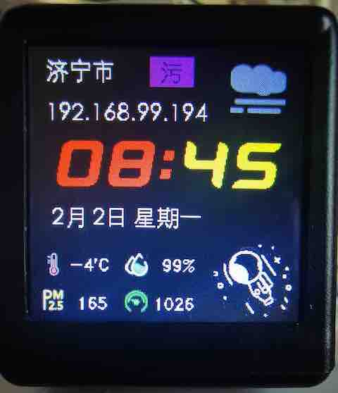
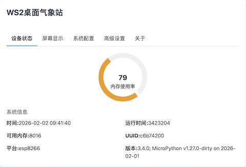

# WS2 Desktop Weather Station

(English | [中文](README.md))

An ESP8266-based desktop weather station capable of displaying real-time weather information, environmental data, and time.




## Features

- 🌤️ **Real-time Weather Display**: Get and display current weather conditions, temperature, humidity, and air quality
- 📺 **TFT LCD Color Display**: 1.54-inch 240x240 pixel color LCD screen
- 🕐 **Multiple Display Modes**: Support for various UI interfaces, including weather clock and photo album modes
- 🌐 **Web Management Interface**: Built-in lightweight web server supporting browser configuration and management
- 📊 **System Monitoring**: Real-time display of device status, memory usage, and network information
- 📡 **WiFi Connectivity**: Support for 2.4GHz WiFi networks with automatic reconnection

## Hardware Specifications

- **Main Controller**: ESP8266/ESP32
- **Display**: 1.54-inch TFT LCD 240×240 pixels
- **Network**: 802.11 b/g/n WiFi

## Software Architecture

This project is developed based on MicroPython and includes the following core modules:

- **app.py** - Main application
- **config.py** - Configuration management
- **wifi_manager.py** - WiFi connection management
- **display.py** - Display screen control
- **nanoweb.py** - Lightweight asynchronous web server
- **captive_portal.py** - Configuration portal

## Quick Start

1. Search for "WiFi Weather Clock" on shopping websites
> Make sure to confirm with the seller that firmware can be downloaded via USB

2. Connect the device via USB and download the complete firmware to ESP8266
   ```bash
   esptool.py --port /dev/ttyUSB0 --baud 460800 write-flash --flash_size=detect 0 firmware.bin
   ```

### Initial Configuration

1. The device creates a WiFi hotspot named `WS2-xxxx` upon startup
2. Connect to this hotspot and the browser will automatically redirect to `192.168.4.1`
3. Enter WiFi information on the configuration page
4. The device will automatically connect and fetch weather information

## Web Management Interface

The device web interface provides the following features:

### Device Status
- View system running status and memory usage
- Monitor device IP address and uptime
- Real-time display of UUID and firmware version

### Screen Display
- Adjust screen brightness
- Switch display modes
- LCD content preview

### System Configuration
- Select city and region
- Set auto-sleep time
- Save/load configuration

### Advanced Settings
- Execute system commands
- View MAC address
- Restart device
- Clear configuration

## API Interface

The device provides RESTful API interfaces, accessible via HTTP requests:

```
GET /lcd                    - Get LCD settings
GET /status                 - Get system status
GET /config                 - Get configuration information
POST /exec                  - Execute system commands {cmd: "Command content", token: "Authentication token"}
POST /lcd/set               - Set LCD parameters {brightness: 80, ui_type: "default"}
POST /config/set            - Set configuration {city: "Beijing", standby_time: "22:00"}
```

## Development Guide

1. Modify relevant files in /src/rom directory and use mpremote romfs to update
2. Custom compilation of MicroPython firmware requires integration of *st7789py_mpy* (not organized yet)

## Troubleshooting

### Common Issues

**Q: Device cannot connect to WiFi**
- A: Check if the WiFi password is correct, or restart the device to reconfigure

**Q: Weather data doesn't update**
- A1: Check network connection or try force-refreshing weather data
- A2: Personal weather server may be offline~

## License

This project is licensed under the MIT License

## Acknowledgments

- [MicroPython](https://micropython.org/) - Efficient Python implementation for microcontrollers
- [ST7789 Driver](https://github.com/devbis/st7789py_mpy) - LCD display driver
- [captive-portal](https://github.com/anson-vandoren/esp8266-captive-portal) - Captive portal
- [Nanoweb](https://github.com/hugokernel/micropython-nanoweb) - Lightweight asynchronous web server
- [mpremote](https://docs.micropython.org/en/latest/reference/mpremote.html) - MicroPython control terminal

## Contact

- Project Homepage: https://github.com/kicer/ws2
- Project Homepage: https://iot.foresh.com/git/kicer/ws2
- Issue Tracker: https://github.com/kicer/ws2/issues
- QQ Group: 697580459
